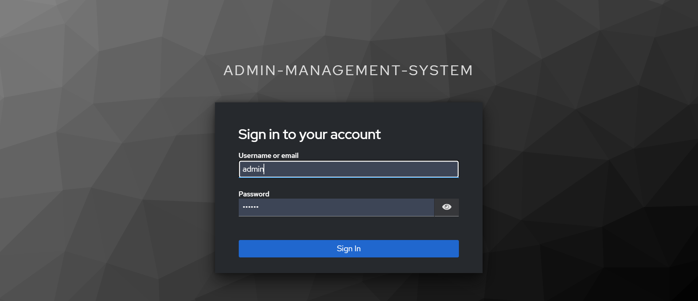
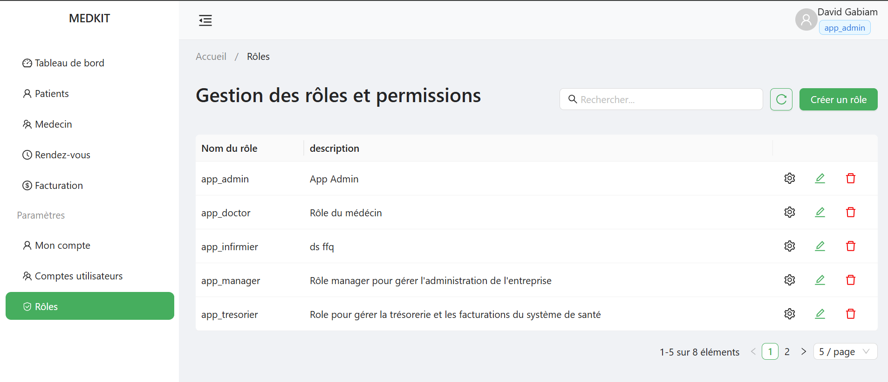
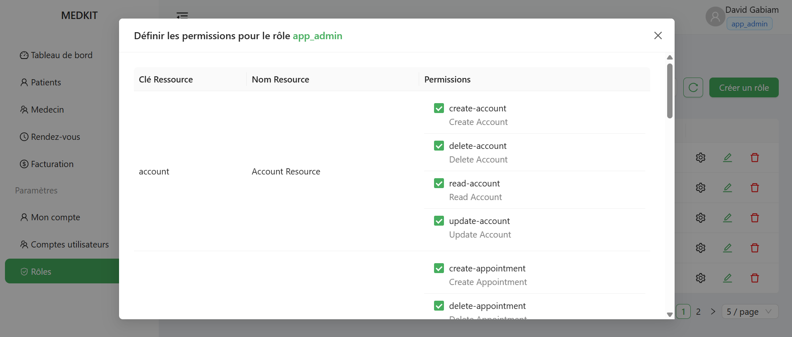
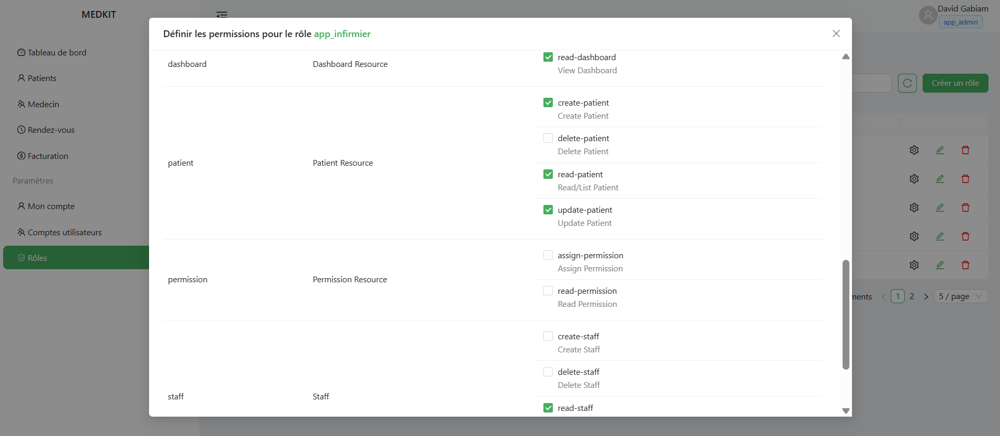
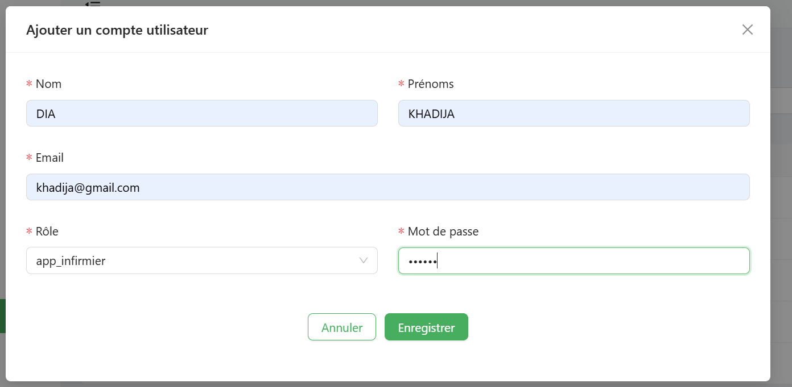
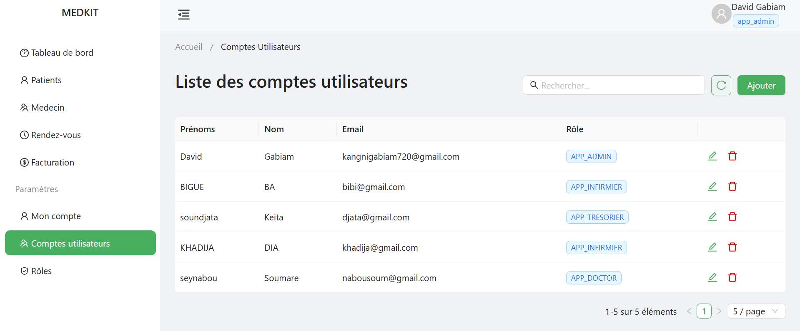
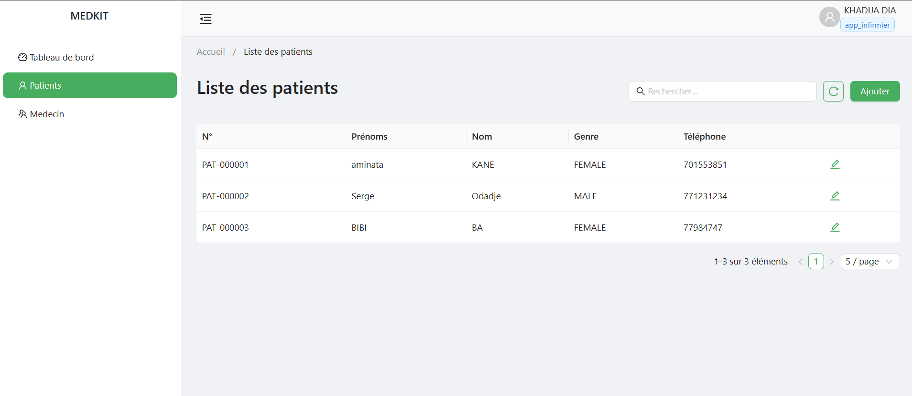

# **Gestion des rôles et permissions avec keycloak dans une application spring-boot**

### Objectif
L'objectif du projet est de développer un système de gestion des permissions selon le rôle des utilisateurs dans une application. Pour ce faire nous allons utiliser l'outil populaire **keycloak**
un outil de gestion des identités et des accès.

### Prérequis
```
Maven
Java 17
Node 20
Angular 19
Docker 
```

### Clone du projet
```
git clone https://github.com/mrDav90/admin-management.git
```

### Exécution du docker compose

1. Depuis la racine du répertoire du projet, on se positionne dans le dossier src/main/docker 
```
cd src/main/docker
```
2. Ensuite on lance la commande pour créer nos conteneurs docker
```
docker-compose up -d
```

### Démarrage de l'application

1. Lancement d'un clean install pour reconstruire tout le projet 
```
mvn clean install
```
2. Démarrage de l'app en mode dev 
```
mvn spring-boot:run -Pdev
```
3. Accès à l'app 
Si tout se passe bien, on peut accéder à l'application sous l'adresse http://localhost:8085

### Démarrage du frontend
1. A la racine du répertoire, on se positionne dans le dossier medical-app
```
cd medical-app
```
2. Une fois dans le répertoire, on démarre l'application frontend avec la commande
```
ng serve
```
3. On peut accéder à l'application sous l'adresse http://localhost:4203
4. Lorsque c'est lancé, on sera redirigé sur l'interface de connexion de keycloak pour nous authentifier. Voici les crédentials
```
login: admin
password: passer
```

### Quelques captures
1. Redirection vers l'interface de keycloak pour l'authentification, connexion en tant qu'admin


2. Liste des rôles de l'application 


3. Définition des permissions du rôle **app_admin**


4. Définition des permissions du rôle **app_infirmier**


5. Ajout d'un compte utilisateur avec le rôle **app_infirmier**


6. Liste des comptes utilisateurs


7. Connexion de l'utilisateur avec rôle **app_infirmier**


8. Espace Infirmier, on peut remarquer qu'on n'a pas accès à toutes les fonctionnalités


**NB**: En cas de soucis d'autorisation, générer un secret token sur keycloak, dans le client privé **admin-management-client**.
Ensuite copier dans la variable d'environnement **CLIENT_SECRET** ou le mettre directement dans le application.yml

### Conclusion
La gestion des rôles et permissions est la clé de voûte de la sécurité et de l'efficacité des SI. En appliquant le principe du moindre privilège, elle garantit que chaque utilisateur n'accède qu'aux ressources strictement nécessaires à sa fonction. Cette approche structurée minimise les risques de sécurité, assure la conformité réglementaire et simplifie l'administration. C'est donc un pilier stratégique pour la protection des données et la performance de l'entreprise.
